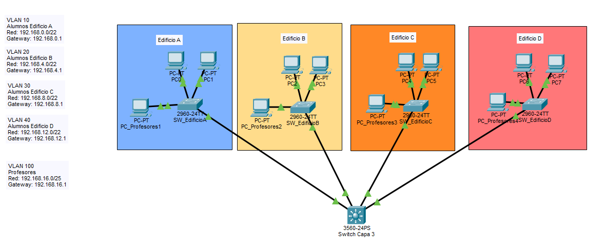

# 🔐 Enrutamiento de VLANs utilizando Switch de capa 3

Proyecto de un enrutamiento de VLANs utilizando Switch de capa 3 en simulador Cisco Packet Tracer.


Este proyecto fue desarrollado como práctica de enrutamiento de VLANs.

---

## 📦 Requisitos

- Cisco Packet Tracer
- Programa que pueda abrir .xlsm **(Excel, ONLYOFFICE Spreadsheet Editor, LibreOffice Calc, Google Sheets)**
- Git (opcional, para clonar)

---

## ⬇️ Descarga del proyecto

### Opción 1: Descargar desde GitHub como ZIP
1. En el repositorio de GitHub, haz clic en **Code → Download ZIP**
2. Extrae el archivo descargado

### Opción 2: Clonar con Git
```bash
git clone https://github.com/AlejandroCastro02/enrutamientoVLAN_SwitchCapa3.git
```
---

## 📁 Abrir en Cisco Packet Tracer

1. Abre el programa Cisco Packet Tracer y selecciona el archivo **enrutamientoVLAN_SwitchCapa3.pkt**



---


## 👨‍💻 Autor

Alejandro Castro  
Proyecto de práctica de enrutamiento de VLANs usando Switch de capa 3 en Cisco Packet Tracer.
